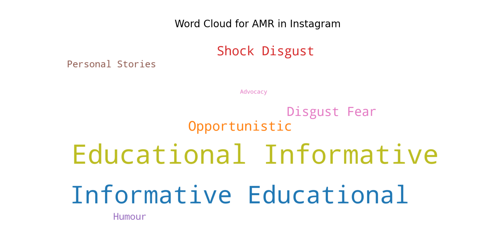

# AMR

This project aims to categorise and evaluate images, videos, and posts related to antimicrobial resistant (AMR) on
Instagram using
Instagram API - Instaloader

## Installation

- Create an environment for the required dependencies

```
conda create -n [ENV_NAME] python ~=3.10
conda activate [ENV_NAME]
cd [CLONED_DIRECTORY]
pip install -r requirements.txt  
```

## Flowchart


## Pre-processing

## Data Visualisation



## Contact

Wei Jan Chang, weijan.chang@gmail.com