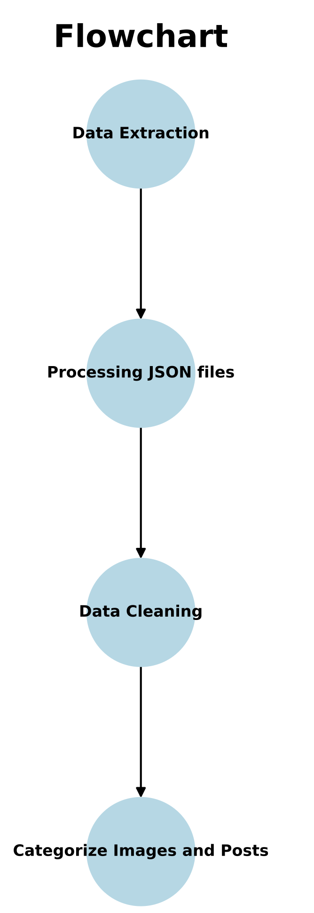

# AMR

This project aims to categorise and evaluate images, videos, and posts related to antimicrobial resistant (AMR) on
Instagram using Instagram API (Instaloader)

## Installation

- Create an environment for the required dependencies

```
conda create -n [ENV_NAME] python ~=3.10
conda activate [ENV_NAME]
cd [CLONED_DIRECTORY]
pip install -r requirements.txt  
```

## Flowchart



- Using [Apify Scraper](https://console.apify.com/actors/shu8hvrXbJbY3Eb9W/input) to extract data using keywords depends
  on research purpose and save it as JSON file.
- Combine json files (each keyword/json file) and find unique id of post
- Select meaningful images to convey health-related information.
- Assign images to different categories

## Usage

### Pre-processing

- After extracted and having JSON file by using Apify
- read directory which including JSON file downloaded and remove unused columns and duplicate id of post. and save it to
  dataframe

```
    d = '[PLEASE ADD YOUR SYSTEM PATH with CORRESPONDING DIRECTORIES]
    ify = load_from_directory(d) # read the JSON files in the directory
    info = [it.collect_latest_posts() for it in ify]
    ret = LatestPostInfo.concat(info)  # concat json files
    df = ret.remove_unused_fields().remove_duplicate().to_dataframe()
```

## Data Visualisation


## Contact

Wei Jan Chang, weijan.chang@gmail.com